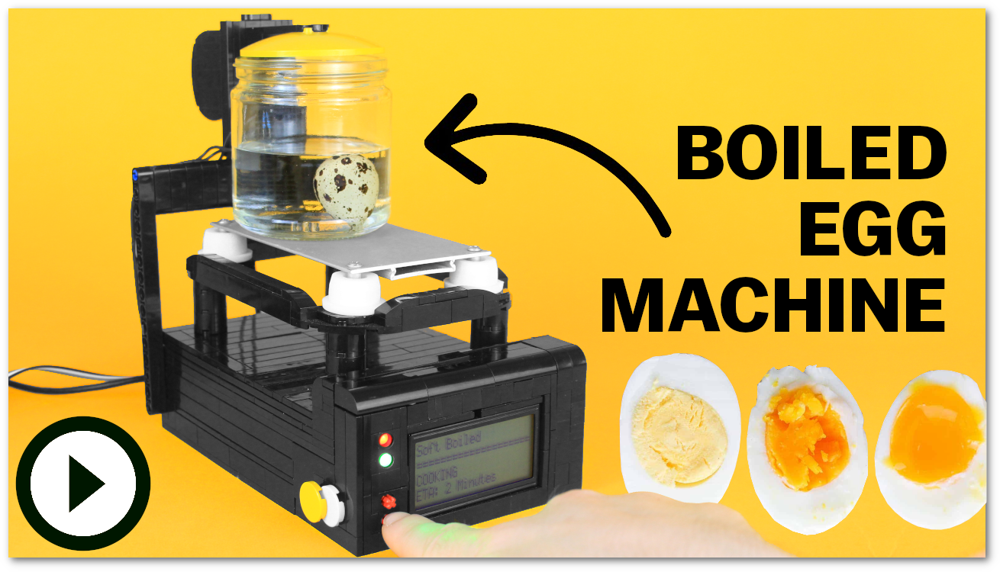
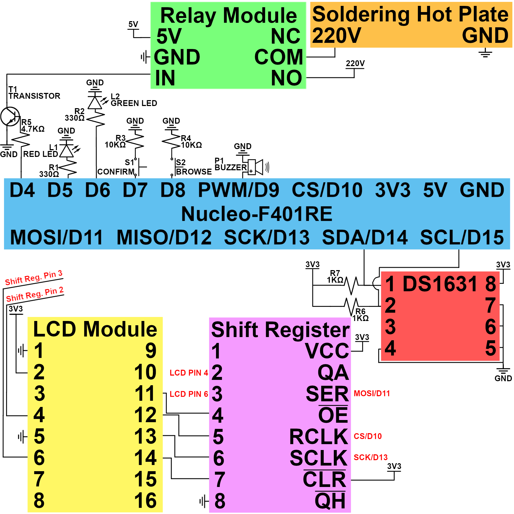

# Hard Boiled Egg Smart Stove - Powered by ARM
---
This hardware engineering project cooks an egg to various doneness levels (soft/medium/hard boiled) powered by components programmed at a low level, versus with libraries. The hardware is accomplished by an [ARM development board](https://www.st.com/en/evaluation-tools/nucleo-f401re.html) coordinating a [soldering plate](https://www.amazon.com/Remover-Heating-Soldering-Welding-Station/dp/B07W1ZZH8T/ref=sr_1_7?crid=2AFZ1592ZUTRB&keywords=soldering+plate&qid=1696189254&sprefix=soldering+plat%2Caps%2C165&sr=8-7), [LCD Character Display](https://www.digikey.com/en/products/detail/newhaven-display-intl/NHD-0420H1Z-FSW-GBW-33V3/2773595), [temperature sensor](https://www.digikey.com/en/products/detail/analog-devices-inc-maxim-integrated/DS1631/680597), and other small components to cook an egg in a user-friendly process.

## Motivation
Wanting to grow my microcontroller skills even outside work hours, I completed an online course on ARM processors before self-appointing a project to manifest all I learned. Having used all the above components throughout the course minus the soldering plate, I embraced my inner foodie (and past as a DIY food automation YouTuber youtube.com/astonishingstudios) to make a stove that automates the cooking process, while being flexible enough to acknowledge users’ preferred egg donenesses.

## Video Demonstration
[Click Here to Watch](https://youtu.be/pxwZWfczoWY) TODO

 TODO Url

## Hardware
* [STM32F401 Nucleo-64 Development Board](https://www.amazon.com/NUCLEO-F401RE-Nucleo-64-Development-STM32F401RE-connectivity/dp/B07JYBPWN4/ref=sr_1_2?crid=1AK4VF3DM7H2B&keywords=nucleo+f401re&qid=1697328825&sprefix=nucleo+f4%2Caps%2C76&sr=8-2)
* [Soldering Hot Plate](https://www.amazon.com/Remover-Heating-Soldering-Welding-Station/dp/B07W1ZZH8T/ref=sr_1_7?crid=2AFZ1592ZUTRB&keywords=soldering+plate&qid=1696189254&sprefix=soldering+plat%2Caps%2C165&sr=8-7)
* [Newhaven LCD NHD-0420H1Z-FSW-GBW-33V3](https://www.amazon.com/Newhaven-Display-NHD-0420H1Z-FSW-GBW-33V3-Character-Modules/dp/B00Q7WEEEI/ref=sr_1_1?crid=X9QLTBSUY7ZU&keywords=newhaven+33v3&qid=1697328878&sprefix=newhaven+33v3%2Caps%2C70&sr=8-1)
* [400 Pin Solderless Breadboard](https://www.amazon.com/DEYUE-breadboard-Set-Prototype-Board/dp/B07LFD4LT6/ref=sr_1_4?dchild=1&keywords=solderless+breadboard&qid=1598765073&sr=8-4)
* [170 Pin Solderless Breadboard (Black)](https://www.amazon.com/gp/product/B07RSBPFN7/ref=ppx_yo_dt_b_search_asin_title?ie=UTF8&th=1)
* [USB-A to Mini USB Cable](https://www.amazon.com/Monoprice-3-Feet-mini-B-28AWG-103896/dp/B003L18SHC/ref=sr_1_3?crid=1POHPW6R8425W&keywords=mini+usb+cable&qid=1697328098&sprefix=mini+usb+cable%2Caps%2C73&sr=8-3)
* [5V 1-Channel Relay Module](https://www.amazon.com/Tolako-Arduino-Indicator-Channel-Official/dp/B00VRUAHLE/ref=sr_1_14?crid=248UB5XFEE6GF&keywords=5v+relay+module&qid=1697328183&sprefix=relay+module%2Caps%2C79&sr=8-14)
* [74HC595N Shift Register](https://www.amazon.com/Texas-Instruments-SN74HC595N-Registers-3-State/dp/B01J6WI7RA/ref=sr_1_5?crid=279YDVY1840PC&keywords=74hc595m+shift+register&qid=1697328349&sprefix=74hc595m+shift+register%2Caps%2C86&sr=8-5)
* [Maxim DS1631 Temperature Sensor](https://www.digikey.com/en/products/detail/analog-devices-inc-maxim-integrated/DS1631/680597)
* [NPN Transistor](https://www.amazon.com/Adafruit-NPN-Bipolar-Transistors-PN2222/dp/B00XW2OK7M/ref=sr_1_6?crid=GJ8K6OBG7VGY&keywords=npn+transistor&qid=1697328713&sprefix=npn+transistor%2Caps%2C78&sr=8-6)
* [10KΩ, 4.7KΩ, 1KΩ, 330Ω Resistors](https://www.amazon.com/Projects-100EP51210K0-10k-Resistors-Pack/dp/B0185FIOTA/ref=sr_1_3?crid=1YWLRAP82U5DW&keywords=10k+resistors&qid=1697329012&sprefix=1k+resistors%2Caps%2C60&sr=8-3)
* [Red and Green LEDs] ()
* [4 Pin Push Bottons](https://www.amazon.com/Gikfun-6x6x5mm-Switch-Button-Arduino/dp/B00R17XUFC/ref=sr_1_3?crid=39GSTUK551V99&keywords=arduino+push+button&qid=1697329292&sprefix=arduino+push+button%2Caps%2C93&sr=8-3)
* [Piezo Buzzer](https://www.amazon.com/a15091400ux0103-Electronic-Mounting-Passive-Sounder/dp/B018I1WBNQ/ref=sr_1_6?crid=1SZ1B06W7EBE1&keywords=piezo+buzzer&qid=1697329333&sprefix=piezo+buzzer%2Caps%2C83&sr=8-6)
* [Jumper Wires](https://www.amazon.com/Elegoo-EL-CP-004-Multicolored-Breadboard-arduino/dp/B01EV70C78/ref=sr_1_4?crid=OAKL7UY5QU9W&keywords=jumper%2Bwires&qid=1697329362&sprefix=jumper%2Bwires%2Caps%2C84&sr=8-4&th=1)
* [Solid Core Wire Kit](https://www.amazon.com/Gauge-Wire-Solid-Hookup-Wires/dp/B088KQFHV7/ref=sr_1_5?crid=D5V3T2RUF18K&keywords=breadboard%2Bwire%2Bspool&qid=1697329445&sprefix=breadboard%2Bwire%2Bspool%2Caps%2C75&sr=8-5&th=1)

The Nucleo-64 electronic schematic can be followed below:

 TODO

### Requirements
The code files require:
1. [MBed Studio](https://os.mbed.com/studio/)

## How to Run the Code
TODO

## Future Possibilities
The soldering plate, which only has on and off modes, makes for an adequate stove because it gets hot enough to boil an egg, but not hotter. An alternative that features temperature control would enable this project to show my PID skills, too.

Similarly, the temperature sensor can read up to 125 degrees Celsius, or 257 degrees Fahrenheit, meaning choosing another sensor would enable the stove to cook other items, especially cuts of meat.

Until then, the project suffices as the best tool in my morning routine arsenal.
